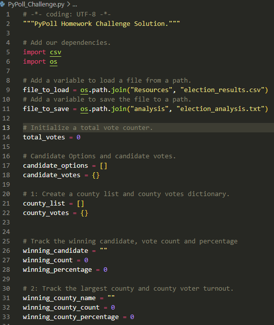
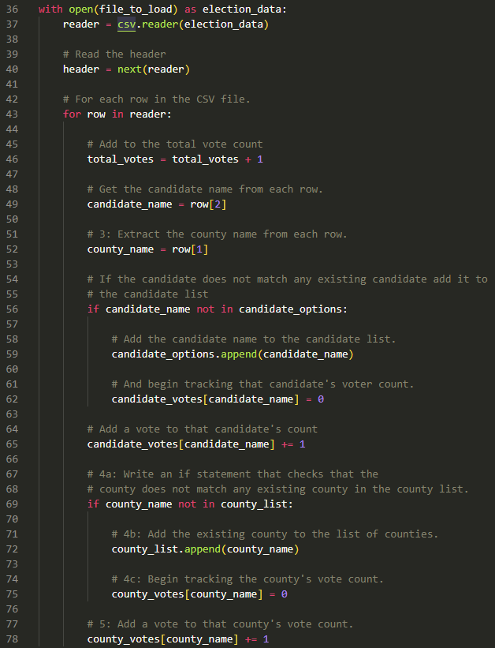
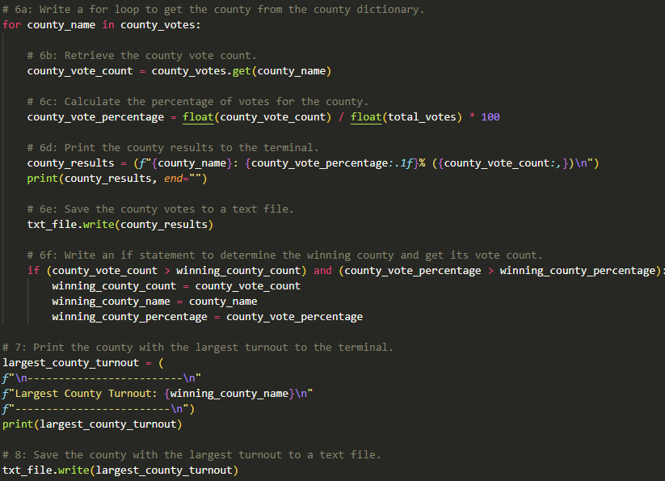
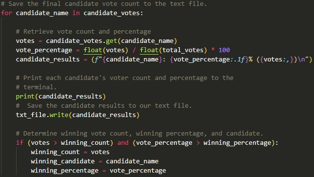
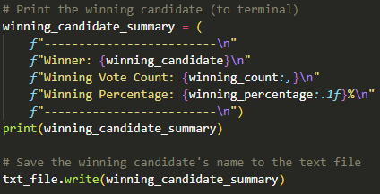

# Election-Analysis

## Overview of Election Audit

In this Module 3 challenge, **Python 3** is used to create a script to analyze the results of an congressional election audit conducted in the counties of Jefferson, Denver and Aparahoe in the State of Colorado.

By executing the [PyPoll](./PyPoll_Challenge.py) **Python 3** script provided, the [Election Results](./Resources/election_results.csv)  input dataset is analyzed and the following questions are addressed:

- What is the total number of votes casted in the election?
- What is the number of votes casted by county and what is their voting percentage with respect to the total number of votes?
- Which county had the largest number of votes?
- What is the number of votes received by each of the candidates and their corresponding voting percentages with respect to the total number of votes?
- Who is the winner of the election? How many votes did the winner get? and what was the winner's voting percentage?

Three deliverables are provided in this analysis:

- This README.md file.
- A [screen capture](./Resources/Output_Terminal.png) of the terminal's output generated by the *Pypoll Python 3* script.
- The results of the election written in an [election analysis](./analysis/election_analysis.txt) text file.

## Election-Audit Results

Before being able to analyze the data, we imported a couple of modules that facilitated the manipulation of the input and the output files.

Then a set of objects (variables, lists, tuples, etc.) were defined to hold the output data.

*Image 1: PyPoll Python 3 script, modules import and objects definition*

### 1. Total number of votes

To count the total number of votes in the election, a **for loop** was used to iterate over each row in the input dataset. It is worth mentioning, that the first row (the header row) was not considered in the total votes count.

### 2. Vote Count by County

Inside the main **for loop** an **if conditional statement** is set to discriminate the votes casted in each of the three counties. While the main for loop iterates through each row of data, this conditional statement add up one vote to the corresponding county every time that the county name is present in the second column of the election result dataset.

### 3. Vote Count by Candidate

In a similar fashion, the votes casted to each candidate were counted using an additional **if conditional statement** defined inside the main **for loop**. Each candidate received an additional vote every time that its names appeared in the third column of the election result dataset.

*Image 2: PyPoll Python 3 script, total number of votes and vote count by county & candidate*

### 4. Results by County

At this point, the vote count by county is computed and saved in a dictionary, a **for loop** is used to breakdown the vote count by county. The number of votes and the percentage of total votes for each county is provided. The county with the largest number of votes is also provided. Notice that the results are printed in the terminal but also written in the output analysis file.

*Image 3: PyPoll Python 3 script, results by county*

### 5. Results by Candidate

Using the same methodology as in the section 4, a **for loop** is set to iterate over the dictionary of votes by candidate in order to breakdown the results. The number of votes and the percentages with respect to the total votes are presented in this section.

*Image 4: PyPoll Python 3 script, results by candidate*

### 6. Winner of the election

The winner of the election is determined based on the vote count and a summary of the winner's statistics is displayed in the terminal and written in the output analysis file.

*Image 5: PyPoll Python 3 script, winner of the election*

## Election-Audit Summary

It has been shown the capabilities of the proposed **Python 3** script to analyze the congressional election audit in three counties of the state of Colorado. The code is capable of processing thousands of lines of data a and provide accurate statistics and results about the election.

However its capabilities can be used and extended to pretty much any election audit. For example, we could perform a whole State senatorial or congressional election analysis by adding up information about all the counties in Colorado.

Furthermore, we could include additional **for loops** and **if conditional statements** to iterate over all the counties in all the states of the country to analyze presidential election results.
